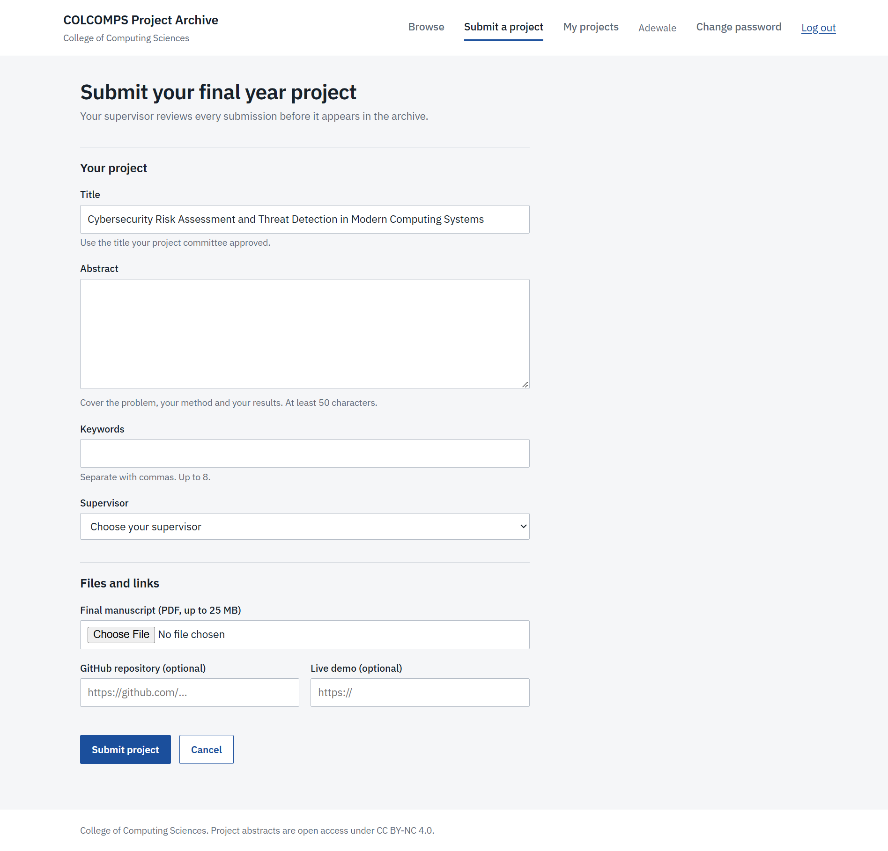
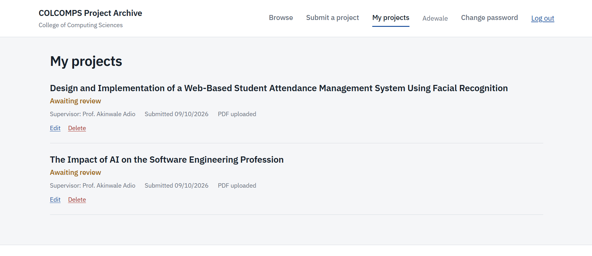
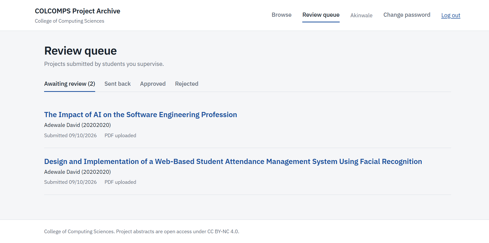
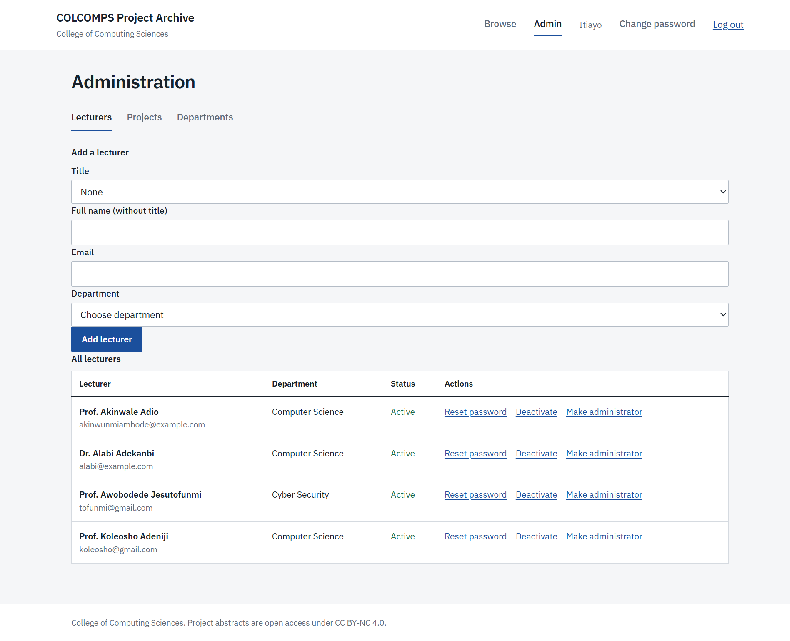

# COLCOMPS Project Archive

A web app where final year students of the College of Computing Sciences submit their projects, supervisors review them, and approved work is published to a searchable public archive.

**Live site:** https://colcomps-projects.vercel.app


## Why this exists

Final year projects are usually handed in as loose PDFs and lost within a few years. This gives the college one place to collect them, review them, and keep them findable by topic, department, supervisor, student or matric number.

## Features

**For everyone**
- Browse and search approved projects by title, keyword, student name or matric number
- Filter by department, session and supervisor, sort by newest, most downloaded or title
- Project pages with abstract, keywords, a ready-made citation, and PDF download

**For students**
- Create an account only when submitting, with the 8-digit matric number
- Submit a project with a PDF, edit it, and resubmit after revisions
- Track review status and read supervisor feedback
- Log in with email or matric number
- Delete a project that has not been approved

**For lecturers (supervisors)**
- A review queue limited to the students assigned to them
- Approve, request revisions, or reject, with a note to the student
- Email notification when a project is submitted or resubmitted

**For administrators**
- Add lecturers with a title (Prof., Dr., and so on), reset their passwords, deactivate them
- Manage departments
- See every project, unpublish or delete one, and reassign a project to another lecturer
- Add other administrators, or promote a lecturer

**Security**
- Passwords hashed with bcrypt, sessions in httpOnly cookies
- Role checks on every protected route, enforced on the server
- Forgot password by emailed one-time link that expires in 1 hour, with only a hash of the token stored
- Rate limiting on login, signup and reset routes, security headers with Helmet
- Uploads checked for file type, size and the PDF signature

## Screenshots

| Submit a project | My projects |
| --- | --- |
|  |  |

| Review queue | Admin panel |
| --- | --- |
|  |  |

## Tech stack

| Area | Tools |
| --- | --- |
| Frontend | React, TypeScript, Vite, React Router, plain CSS |
| Backend | Node.js, Express 5, TypeScript, Mongoose, Zod |
| Database | MongoDB Atlas |
| File storage | Cloudinary |
| Email | Brevo transactional API |
| Hosting | Vercel (frontend), Render (backend) |

## How it fits together

- The frontend calls `/api/...`. In development, Vite proxies that to the backend. In production, Vercel rewrites it to the Render service, so the browser only ever talks to one site and login cookies stay first-party.
- The backend is split by feature, with `models`, `controllers` and `routes` folders and files named after the feature, like `admin.controller.ts` and `admin.routes.ts`.

```
colcomps-project-archive/
  backend/
    src/
      config/        database and Cloudinary setup
      controllers/   request handlers
      middleware/    auth, roles, uploads, rate limits, errors
      models/        Mongoose schemas
      routes/        route definitions
      scripts/       seed scripts
      types/         Express type extensions
      utils/         tokens, email, notifications, PDF cleanup
  frontend/
    src/
      components/    layout, route guard, admin tabs
      context/       auth state
      hooks/         useAuth
      lib/           API helper, name and status helpers
      pages/         one file per page
```

## Running it locally

You need Node.js 20 or newer, a free MongoDB Atlas cluster, a Cloudinary account, and a Brevo account (only needed for email).

```bash
git clone https://github.com/Itiayooo/colcomps-project-archive.git
cd colcomps-project-archive
```

**Backend**

```bash
cd backend
npm install
cp .env.example .env     # then fill in the values
npm run seed:departments
npm run seed:admin
npm run dev
```

**Frontend** (in a second terminal)

```bash
cd frontend
npm install
npm run dev
```

Open http://localhost:5173.

### Environment variables

Set these in `backend/.env`. `.env.example` has the full list.

| Variable | What it is |
| --- | --- |
| `MONGODB_URI` | MongoDB connection string, with a database name |
| `JWT_SECRET` | Long random string used to sign login tokens |
| `CLIENT_URL` | Frontend address, used for CORS and links in emails |
| `CLOUDINARY_CLOUD_NAME`, `CLOUDINARY_API_KEY`, `CLOUDINARY_API_SECRET` | PDF storage |
| `BREVO_API_KEY`, `MAIL_FROM_EMAIL`, `MAIL_FROM_NAME` | Sending email |
| `ADMIN_NAME`, `ADMIN_EMAIL`, `ADMIN_PASSWORD` | Used once by `seed:admin` to create the first administrator |

Generate a secret with `node -e "console.log(require('crypto').randomBytes(32).toString('hex'))"`.

### Scripts (backend)

| Command | What it does |
| --- | --- |
| `npm run dev` | Start the API with auto-restart |
| `npm run build` then `npm start` | Compile and run for production |
| `npm run seed:departments` | Create the four departments |
| `npm run seed:admin` | Create the first administrator, who must change the password on first login |
| `npm run seed:demo` | Fill a local database with sample accounts and projects, all with the password `password123`. Local use only, it refuses to run in production |

## Deployment

- **Backend on Render:** root directory `backend`, build command `npm install --include=dev && npm run build`, start command `npm start`, health check path `/api/health`. Add the environment variables above.
- **Frontend on Vercel:** root directory `frontend`. `vercel.json` rewrites `/api/*` to the Render service and sends every other path to the app, so page refreshes work.
- Use a separate database for demos and for real data.

## Notes

- The free Render plan puts the backend to sleep when idle, so the first request after a quiet period can take a while.
- Emails are sent from a regular Gmail address through Brevo, so some may land in spam until a custom domain is set up.

## Author

Built by Itiayo.